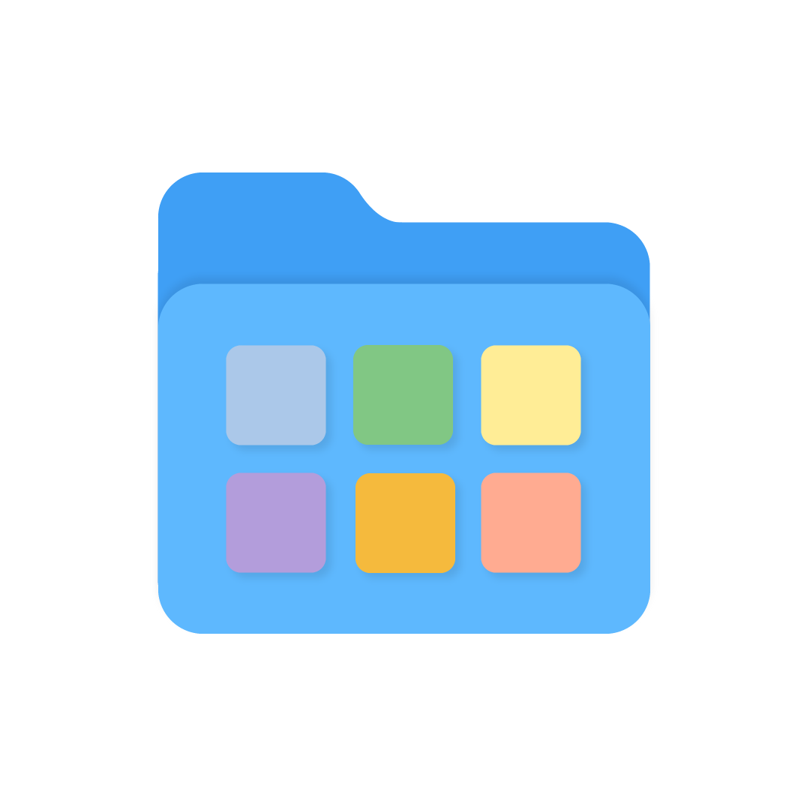
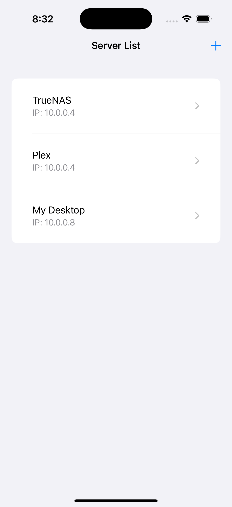
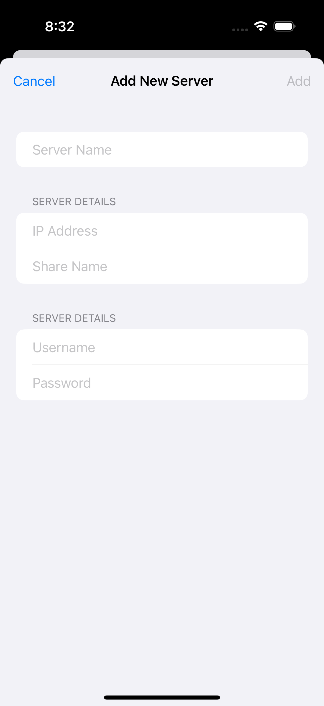
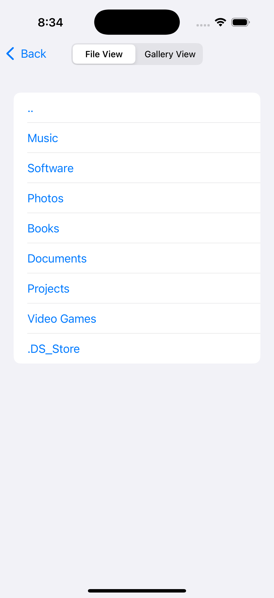
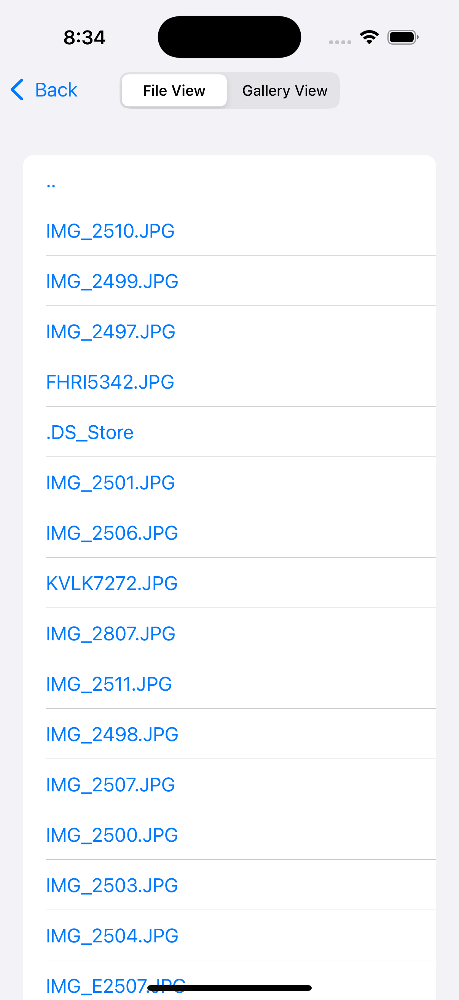

<h1 style="display: flex; align-items: center; justify-content: center; gap: 8px;">
  
  SMB Gallery iOS Application
</h1>

SMB Client is an iOS application that connects to SMB shares and displays image directories as a thumbnail-based gallery for easy browsing.

## Why I Made This
The Apple Files app, when connected to an SMB share, lacks the ability to show thumbnails for image files, making it a painful experience to browse and find specific images. You have to painstakingly click on each file to load and view its content, which can be frustrating, especially with large image directories. 

This app solves that problem by offering a **Gallery View** that shows thumbnail previews of all images within a directory, allowing for quick and easy browsing. Now, you can connect to SMB shares and visually browse your image directories with ease, without needing to open each file individually.

## Features
- **SMB Share Connectivity**: Connects to user-added SMB servers using the [SMBClient](https://github.com/kishikawakatsumi/SMBClient) Swift library.
- **Multiple Connections**: Allows users to add and switch between multiple SMB server connections.
- **Secure Password Storage**: Uses Apple Keychain to securely store, retrieve, and delete server passwords.
- **File View**: Displays files in directories, similar to other file browser apps.
- **Gallery View**: Shows all images in a directory as a scrollable gallery with thumbnail previews for easy browsing.

## Screenshots

|  |  |  |  |  |
|:--:|:--:|:--:|:--:|:--:|
| _Server List_ | _Add Server_ | _File View(1)_ | _File View(2)_ | _Gallery View_ |

## Installation

1. Clone or download the repo to your local machine.
2. Open the project in Xcode.
3. Connect your iOS device (or use the iOS Simulator).
4. Build and run the project.

Ensure your device is directly connected to the same network as your SMB server for smooth browsing. Performance over VPN tends to be sluggish and isn't ideal.

## Usage
1. Open the app and add an SMB server (IP address, SMB share name, username, and password).
2. Browse a directory that includes image files (.jpg, .jpeg, or .png).
3. Toggle between **File View** and **Gallery View** to browse images with or without thumbnails.

## Notes
This project served as my introduction to Swift, and I intend to develop a more substantial project in the future. I also plan to enhance image interactivity by adding features such as downloading and full-screen viewing.

I would also like to implement SQLite as a data solution. I think that would be cool to try out.